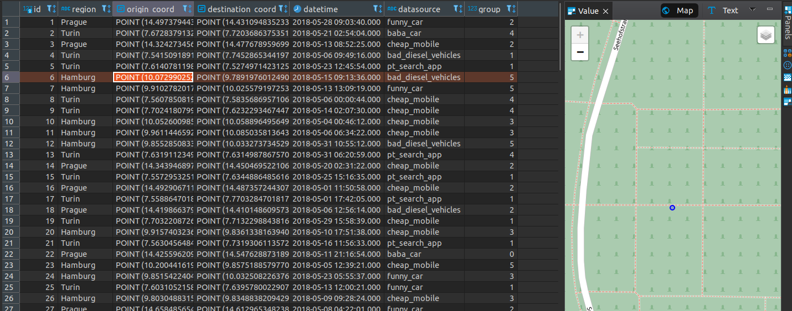
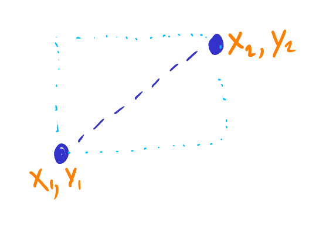
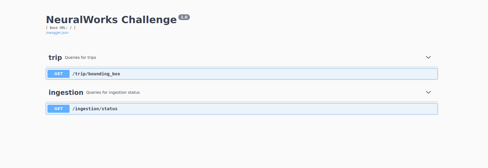
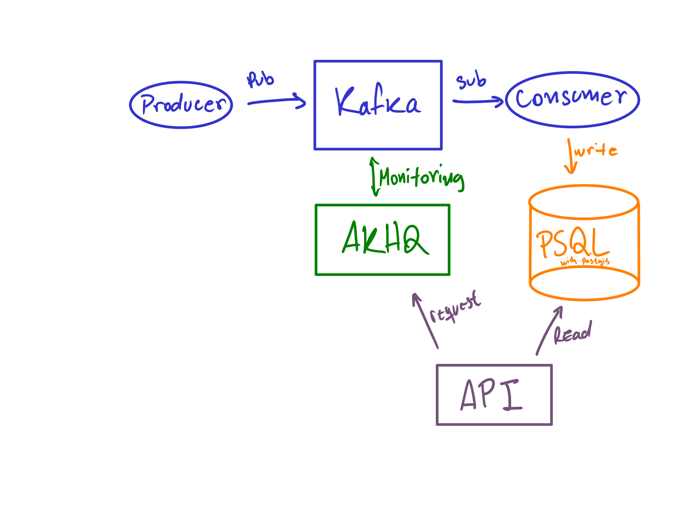

# NeuralWorks Challenge

## Componentes
Este proyecto utiliza las siguientes herramientas (todo se ejecuta mediante el `docker-compose.yaml`):
- PostgreSQL con Postgis para almacenar los datos y realizar consultas geoespaciales.
- Kafka: Para procesamiento de datos en tiempo real.
- AKHQ: Para monitorear Kafka y obtener estado de ingesta.

Basta con ejecutar este comando para correr todos los componentes y aplicaciones:

```commandline
docker-compose up
```


## Soluciones
### 1. Agrupación de viajes y procesos automatizados para ingerir y almacenar los datos bajo demanda
Para la agrupación de viajes similares, se ha utilizado un algoritmo simple de Kmeans (ver _notebook_ `model.ipynb` para más detalle).

Para la ingestión de datos se hizo el supuesto de que los datos se transmiten en tiempo real. Para esto se creó:
- Productor: Es un proceso que se encarga de leer `trips.csv` y produce fila a fila una cantidad de veces determinada (definida por la variable de entorno `NUM_MESSAGES`).
- Consumidor: Consume los mensajes que están en Kafka. Se consume en *batches* (definido por la variable de entorno `BATCH_SIZE`). Además este proceso se encarga de utilizar el modelo de agrupación y guardar los registros en la base de datos.

El resultado del consumidor es una tabla con las siguientes columnas:


### 2. Un servicio que es capaz de proporcionar la siguiente funcionalidad:
- Promedio semanas de cantidad de viajes por región dada unas coordenadas.
- Informar sobre el estado de la ingesta de datos.

Para esto se ha facilitado una API escrita en Flask-restx, donde se tienen dos endpoints:
- Método GET en `/trip/bounding_box` donde recibe las coordenadas de búsqueda para buscar el promedio de viajes semanales por región. Este endpoint recibe el nombre de la región y dos puntos de referencia, de tal forma se crea un bounding box, como muestra la siguiente imagen:

- Método GET en `/ingesiton/status` para ver el estado de la ingesta de datos.

Se puede consultar directamente en el Swagger de la aplicación (http://localhost:5000/)


### 3. La solución debe ser escalable a 100 millones de entradas. Se recomienda simplificar los datos mediante un
modelo de datos. Agregue pruebas de que la solución es escalable.

Para esto se han inicializado la base de datos PostgreSQL con índices _btree_ en las columnas `region` y `datetime` e índices geométricos en los campos `coord_orig` y `coord_destination` para búsquedas geoespaciales.

Para comprobar esto, se debe cambiar la variable de entorno `NUM_MESSAGES` de producer en el `docker-compose.yaml` a un número muy grande y utilizar la API.

### Flujo de datos

El flujo de datos es bastante sencillo, el hecho de que las aplicaciones estuviesen dockerizadas permite una fácil ejecución de todo el ecosistema. Por otro lado, si se quisiera escalar los productores o consumidores bastaría con:

```commandline
docker-compose up -d --scale consumer=3
```

El flujo contemplado es:
- Productor envía datos a Kafka.
- Consumidor recibe los datos en tiempo real y guarda los resultados.
- AKHQ monitorea a Kafka.
- API realiza consultas a la base de datos y AKHQ.



### Otros

El proyecto cuenta con pre-commit para:
- Respetar standard PEP8
- Ordenar imports.
- Ordenar requirements.txt
- Arreglar archivos .yaml


Para llevar a cabo esta solución a la nube (AWS, GCP, etc) es bastante sencillo, dado que ya se tienen las imagenes para cada aplicación.
En el caso de utilizar AWS por ejemplo, se pueden usar algunos servicios como:
- MSK para administrar Kafka
- RDS para administrar PSQL
- EKS como orquestador de contenedores (producer, consumer, api y AKHQ)
